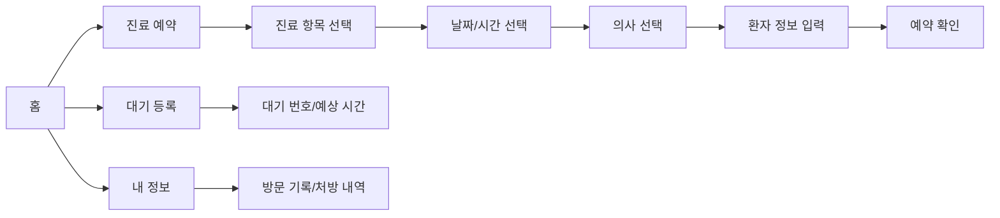

# Hospital Booking App

정형외과 진료 예약과 현장 대기 등록을 모바일 화면 중심으로 구현한 `React + TypeScript` 웹 앱입니다. 사용자는 진료 과목, 날짜, 시간, 의사를 선택해 예약 흐름을 진행하고, 대기 번호 확인과 방문 기록 조회까지 하나의 앱 안에서 확인할 수 있습니다.

## 프로젝트 목적

병원 방문 전후의 반복적인 접수 과정을 줄이고, 외국인 환자도 쉽게 사용할 수 있는 다국어 진료 예약 경험을 만드는 것이 목표입니다. 실제 병원 서비스로 확장하기 전, 모바일 UX와 예약 흐름을 빠르게 검증하기 위한 프론트엔드 프로토타입으로 제작했습니다.

## 핵심 기능

- 홈 화면의 빠른 예약/대기 등록 진입
- 진료 항목 선택
- 날짜 및 시간 슬롯 선택
- 의사 선택
- 환자 이름, 전화번호, 증상 입력
- 예약 확인 화면
- 현장 대기 등록 및 예상 대기 시간 표시
- 방문 기록과 처방 내역 조회
- 한국어, 베트남어, 태국어 다국어 전환 구조
- 하단 탭 기반 모바일 내비게이션
- PWA manifest와 service worker 기반 앱 설치 가능 구조

## 사용 기술

| 영역 | 기술 | 사용 이유 |
| --- | --- | --- |
| Frontend | React, TypeScript, Vite | 빠른 개발 환경과 타입 기반 UI 안정성 확보 |
| UI | Tailwind CSS, Radix UI, MUI | 모바일 중심 컴포넌트와 접근성 있는 UI 구성 |
| Interaction | motion, lucide-react | 자연스러운 화면 전환과 명확한 아이콘 표현 |
| Routing/State | React state 중심 구조 | MVP 단계에서 예약 흐름을 단순하고 빠르게 검증 |
| PWA | manifest, service worker | 모바일 앱처럼 설치 가능한 구조 실험 |
| Deploy | Vercel 설정 | 정적 프론트엔드 배포에 적합 |

## 앱 흐름



## 실행 방법

```bash
npm install
npm run dev
```

배포용 빌드:

```bash
npm run build
```

## 현재 범위

- 이 프로젝트는 프론트엔드 중심의 진료 예약 UX 프로토타입입니다.
- 예약 데이터, 대기 번호, 방문 기록은 실제 병원 서버와 연결된 값이 아니라 화면 흐름 검증용 데이터입니다.
- 실제 서비스화를 위해서는 인증, 병원 예약 DB, 관리자 페이지, 알림 시스템, 개인정보 보호 정책이 추가로 필요합니다.
- 일부 다국어 텍스트는 프로토타입 단계에서 관리되고 있어 실제 배포 전 번역 검수와 인코딩 정리가 필요합니다.

## 개선 방향

- 병원 예약 API 및 데이터베이스 연동
- 환자 인증과 개인정보 보호 플로우 추가
- 관리자용 예약/대기열 관리 화면 구현
- SMS 또는 카카오 알림 연동
- 다국어 번역 파일 정리 및 i18n 라이브러리 도입
- 실제 병원 운영 시간, 의사 스케줄, 휴진일 반영

## GitHub

- Repository: [bruhcio/hospital-booking-app](https://github.com/bruhcio/hospital-booking-app)
