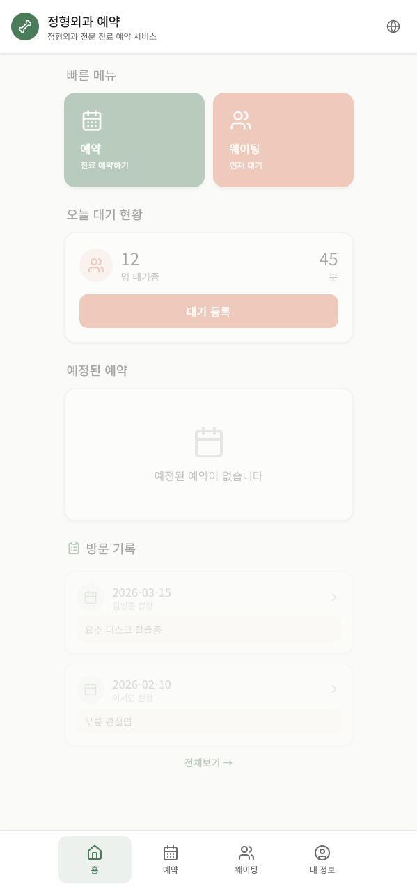

<div align="center">

# Hospital Booking App

A mobile-first hospital booking prototype for appointments, walk-in queues, visit history, and multilingual patient flows.


</div>

## Preview / 예시 화면

<p align="center">
  
</p>

The home screen brings appointment booking, walk-in waiting, today's queue status, upcoming appointments, and visit history into one mobile-first dashboard.

홈 화면은 `진료 예약`, `현재 대기`, `오늘 대기 현황`, `예정된 예약`, `방문 기록`을 한 화면에서 확인할 수 있도록 구성했습니다.

---

## Overview

Hospital Booking App is a `React + TypeScript` web prototype designed around the common hospital visit flow: booking an appointment, registering for a walk-in queue, checking wait status, and reviewing visit records.

The goal is to reduce repetitive reception steps and test a mobile healthcare UX before connecting to a real hospital backend.

## Core Flow

- Choose a medical service
- Select date, time, and doctor
- Enter patient information and symptoms
- Confirm an appointment
- Register for on-site waiting
- Check queue number and estimated waiting time
- Review visit and prescription history
- Switch between Korean, Vietnamese, and Thai text structure

## Stack

| Area | Technology |
| --- | --- |
| Frontend | React, TypeScript, Vite |
| UI | Tailwind CSS, Radix UI, MUI |
| Interaction | motion, lucide-react |
| App shell | PWA manifest, service worker |
| Deploy | Vercel configuration |

## Run

```bash
npm install
npm run dev
```

Build:

```bash
npm run build
```

## Current Scope

This is a frontend-centered MVP. Appointment data, queue numbers, and visit history are prototype data, not production hospital records.

## Next Steps

- Connect a real booking API and database
- Add patient authentication and privacy flow
- Build an admin dashboard for schedule and queue management
- Introduce SMS or Kakao notification flow
- Clean multilingual resources into an i18n structure

---

## 한국어 버전

# 병원 예약 앱

예약, 현장 대기, 방문 기록, 다국어 환자 흐름을 모바일 중심으로 설계한 병원 서비스 프로토타입입니다.

## 개요

Hospital Booking App은 일반적인 병원 방문 과정을 `React + TypeScript`로 구현한 웹 프로토타입입니다. 사용자는 진료 예약, 현장 대기 등록, 대기 상태 확인, 방문 기록 조회 흐름을 하나의 모바일 화면 안에서 경험할 수 있습니다.

목표는 반복적인 접수 과정을 줄이고, 실제 병원 backend와 연결하기 전 모바일 헬스케어 UX를 빠르게 검증하는 것입니다.

## 핵심 흐름

- 진료 항목 선택
- 날짜, 시간, 의사 선택
- 환자 정보와 증상 입력
- 예약 확인
- 현장 대기 등록
- 대기 번호와 예상 대기 시간 확인
- 방문 기록과 처방 내역 조회
- 한국어, 베트남어, 태국어 텍스트 구조 전환

## 기술 스택

| 영역 | 기술 |
| --- | --- |
| Frontend | React, TypeScript, Vite |
| UI | Tailwind CSS, Radix UI, MUI |
| Interaction | motion, lucide-react |
| App shell | PWA manifest, service worker |
| Deploy | Vercel configuration |

## 실행

```bash
npm install
npm run dev
```

빌드:

```bash
npm run build
```

## 현재 범위

이 프로젝트는 frontend 중심 MVP입니다. 예약 데이터, 대기 번호, 방문 기록은 실제 병원 기록이 아니라 프로토타입용 데이터입니다.

## 개선 방향

- 실제 예약 API 및 database 연결
- 환자 인증과 개인정보 보호 flow 추가
- 일정/대기열 관리를 위한 admin dashboard 구현
- SMS 또는 카카오 알림 flow 도입
- 다국어 resource를 i18n 구조로 정리

## 디자인 방향

- 모바일 우선 레이아웃
- 빠른 예약과 대기 등록을 분리한 하단 탭 구조
- 의료 서비스에 맞는 차분한 녹색/피치 계열 상태 색상
- 환자가 다음 행동을 쉽게 판단할 수 있는 큰 카드형 액션
